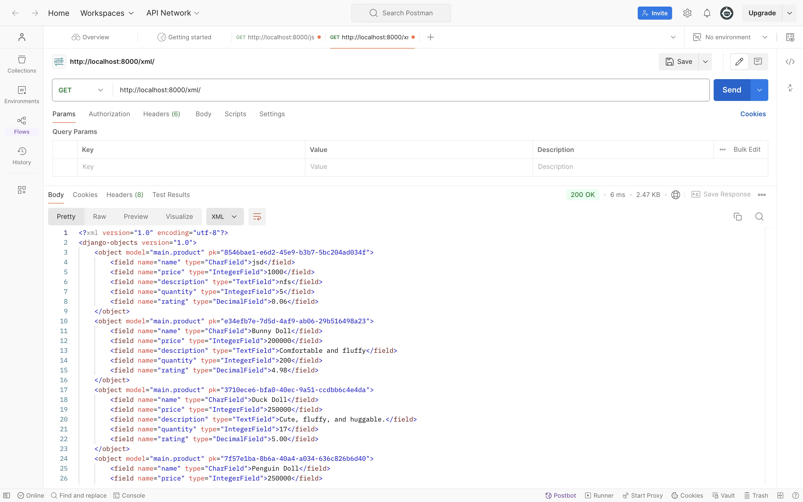
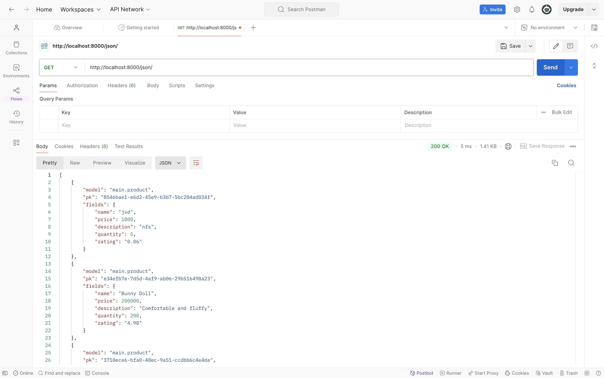
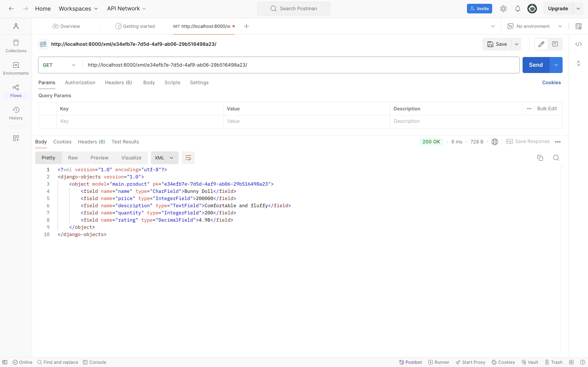
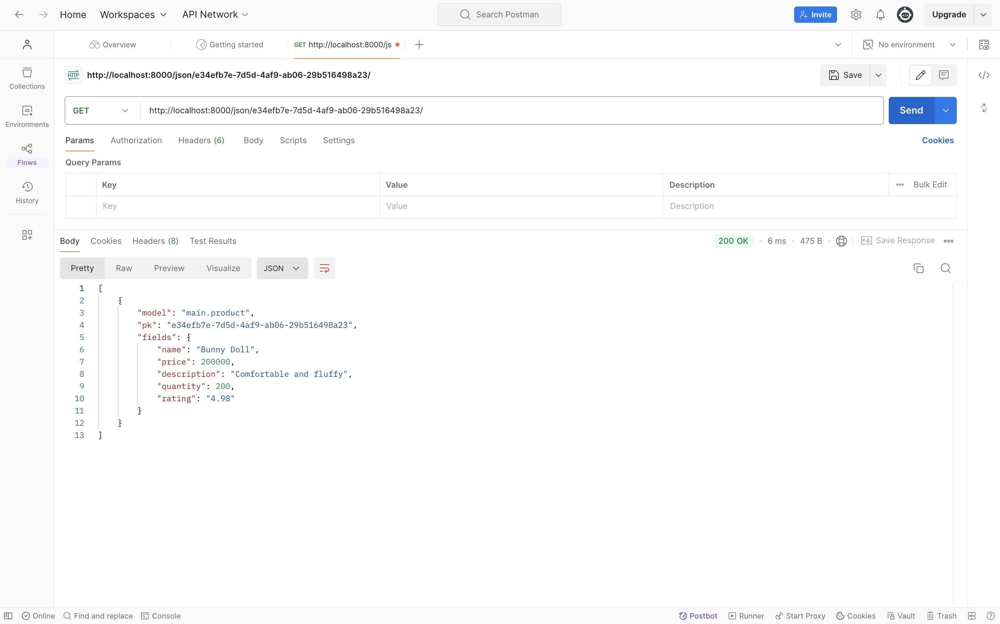

# Tugas 2: Implementasi Model-View-Template (MVT) pada Django
**Nama**: Meisya Najla Aqilah

**NPM**: 2306209870

**Kelas**: PBP C

**Link Deploy**: http://meisya-najla-thegoodsplace.pbp.cs.ui.ac.id/

# Jelaskan bagaimana cara kamu mengimplementasikan checklist di atas secara step-by-step.
Checklist tersebut diimplementasikan dengan cara-cara berikut.
1. **Membuat sebuah proyek Django baru**

Pertama, saya membuat direktori lokal dengan nama the-goods-place. Setelah itu, saya membuat virtual environment pada direktori tersebut dengan tujuan agar pengembangan aplikasi yang saya ingin buat terisolasi. Selanjutnya, dalam direktori lokal the-goods-place, saya membuat berkas requirements.txt, yang kemudian saya instalasikan. Setelah terinstalasi, saya membuat proyek Django dengan nama the_goods_place serta membuat kerangka dasar dari proyek Django tersebut.

2. **Membuat aplikasi dengan nama `main` pada proyek tersebut**

Kedua, saya membuat aplikasi baru dengan nama main dalam direktori the-goods-place. Selanjutnya, saya mendaftarkan ‘main’ pada variabel INSTALLED_APPS dalam berkas setting.py.

3. **Melakukan routing pada proyek agar dapat menjalankan aplikasi `main`**

Ketiga, saya membuat berkas urls.py dalam direktori ‘main’ dan menambahkan main.urls pada berkas urls.py pada direktori the_goods_place agar dapat menampilkan ‘main’ ketika URL diakses.

4. **Membuat model pada aplikasi `main` dengan nama Product dan memiliki atribut wajib seperti `name`, `price`, dan `description`**

Keempat, saya membuka berkas models.py dalam direktori aplikasi ‘main’ dan mengubah isi berkas tersebut sesuai ketentuan yang saya inginkan. Setelah itu, saya mengaplikasikan migrasi models untuk melakukan migrasi ke dalam database lokal.

5. **Membuat sebuah fungsi pada `views.py` untuk dikembalikan ke dalam sebuah template HTML yang menampilkan nama aplikasi serta nama dan kelas kamu**

Kelima, saya membuka berkas views.py dlaam direktori aplikasi ‘main’ dan menambahkan import render serta mengatur fungsi show_main sesuai ketentuan yang saya inginkan. Selanjutnya, saya memodifikasi kembali main.htlm yang berada di dalam direktori templates agar menyesuaikan dengan data yang ingin ditampilkan.

6. **Membuat sebuah routing pada `urls.py` aplikasi main untuk memetakan fungsi yang telah dibuat pada `views.py`**

Keenam, saya kembali membuka berkas urls.py dalam direktori ‘main’ dan menambahkan main.urls pada berkas urls.py pada direktori the_goods_place agar dapat menampilkan ‘main’ ketika URL diakses.

# Buatlah bagan yang berisi request client ke web aplikasi berbasis Django beserta responnya dan jelaskan pada bagan tersebut kaitan antara urls.py, views.py, models.py, dan berkas html.
**Link**: https://drive.google.com/file/d/1i7m_kwbv4uCEKAWM8tZ7W3-O8Fn1p2bD/view?usp=sharing

# Jelaskan fungsi git dalam pengembangan perangkat lunak!
Fungsi git dalam pengembangan perangkat lunak adalah sebagai sistem kontrol untuk mengembangkan, mengelola, dan melacak perubahan kode secara terstuktur, aman, dan kolaboratif.
1. Git memungkinan user untuk bekerja pada fitur baru maupun berbaikan dalam branch terpisah sehingga user dapat berkolaborasi dengan tim tanpa mempengaruhi pekerjaan user lainnya.
2. Git membantu dalam pengaturan dan penggabungan perubahan yang dibuat oleh berbagai anggota tim dengan menjaga kode tetap terstruktur.
3. Git mencatat semua perubahan yang dibuat pada kode demi memudahkan user untuk melihat riwayat perubahan, apa yang telah diubah, dan kapan perubahan itu terjadi.

# Menurut Anda, dari semua framework yang ada, mengapa framework Django dijadikan permulaan pembelajaran pengembangan perangkat lunak?
Framework Django dijadikan permulaan dalam pembelajaran pengembangan perangkat lunak karena  beberapa alasan berikut.
1. Django menggunakan bahasa pemrograman Python yang lebih mudah dipahami oleh pemula.
2. Django menerapkan pola struktur Model-View-Template (MVT) yang memudahkan pengguna untuk lebih memahami alur pengembangan strukturnya.
3. Django memiliki dokumentasi yang sangat lengkap dan lebih dimengerti sehingga memudahkan proses pembelajaran bagi pemula. 

# Mengapa model pada Django disebut sebagai ORM?
Model pada Django disebut sebagai Object-Relational Mapping (ORM) karena memiliki peran dalam memetakan objek dalam kode Python ke dalam tabel pada struktur database regional tanpa perlu melibatkan query SQL secara langsung.

# Tugas 3: Implementasi Form dan Data Delivery pada Django
## Jelaskan mengapa kita memerlukan data delivery dalam pengimplementasian sebuah platform?
Dalam pengimplementasian sebuah platform, data delivery diperlukan sebagai proses transfer data secara efektif, efisien, dan terpercaya dari satu titik ke titik lainnya, baik antara sistem, perangkat, maupun pengguna.
1. Data delivery memastikan informasi yang diperlukan pengguna ataupun sistem dapat diakses secara cepat dan efisien untuk menjaga platform beroperasi dengan lancar.
2. Data delivery melibatkan enkripsi serta mekanisme keamanan lainnya yang dilakukan dengan aman untuk mencegah baik kebocoran maupun akses data secara tidak sah.
3. Data delivery memastikan data dapat ditransfer dan diterima antar sistem secara efektif dan efisien sehingga menciptakan platform dengan integrasi yang lancar.

## Menurutmu, mana yang lebih baik antara XML dan JSON? Mengapa JSON lebih populer dibandingkan XML?
Menurut saya pribadi, JSON lebih baik daripada XML. Formatnya yang lebih ringan dan sederhana membuat JSON menjadi lebih banyak digunakan, terutama dalam pengembangan website.
1. JSON menggunakan lebih sedikit teks karena tidak memerlukan declaration awal seperti XML, sehingga lebih hemat bandwidth saat mengirimkan data.
2. JSON diproses lebih cepat, karena langsung terintegrasi dengan JavaScript, dan lebih ringan dibandingan XML, yang memerlukan proses parsing lebih kompeks.
3. JSON memiliki struktur yang lebih sederhana dan format objek yang mirip dengan JavaScript, sehingga memudahkan user dalam memahami serta menulis kode.

## Jelaskan fungsi dari method `is_valid()` pada form Django dan mengapa kita membutuhkan method tersebut?
Dalam Django, method is_valid() merupakan function yang digunakan untuk memvalidasi dan menjaga keamanan data yang diinput ke dalam form.
1. Method is_valid() secara otomatis akan memeriksa setiap field dalam form untuk memeriksa bahwa data yang diberikan sudah benar dan sesuai dengan spesifikasi yang diharapkan.
2. Jika semua data valid, method akan mengembalikan nilai True dan menyimpan data yang sudah divalidasi tersebut. Ini membantu dalam mengelola kesalahan dengan menampilkan pesan error, sehingga dapat mengurasi risiko keamanan yang dapat muncul dari data tidak valid. 

## Mengapa kita membutuhkan `csrf_token` saat membuat form di Django? Apa yang dapat terjadi jika kita tidak menambahkan `csrf_token` pada form Django? Bagaimana hal tersebut dapat dimanfaatkan oleh penyerang?
csrf_token dibutuhkan ketika membuat form di Django dengan tujuan untuk melindungi aplikasi dari serangan Cross-Site Request Forgery (CSRF). Serangan CSRF merupakan jenis serangan dimana penyerang dapat memanipulasi user yang telah login ke situs untuk mengirimkan permintaan yang tidak sah ke server (seperti mengubah data pengguna, menyebarkan malware, dan/atau melakukan transaksi tidak legal), tanpa diketahui atau disetujui oleh pengguna tersebut. Tanpa crsf_token, website Django akan menjadi rentan terhadap serangan CSRF sehingga dapat menyebabkan kerugian serius baik bagi pengguna maupun bagi sistem.

## Jelaskan bagaimana cara kamu mengimplementasikan checklist di atas secara step-by-step.
1. **Membuat input `form` untuk menambahkan objek model pada app sebelumnya**  
Pertama, saya membuat berkas baru dengan nama forms.py dalam direktori main untuk menyimpan struktur form yang akan menerima data tersebut. Kemudian, dalam berkas views.py, ditambahkan beberapa import dari main.forms dengan tujuan untuk memanggil forms ketika dibuka. Setelah itu, saya menambahkan fuction baru create_product_entry dengan menggunakan form.is_valid() dengan tujuan untuk memvalidasi isi input tersebut. Selanjutnya, saya melakukan routing URL dengan mengimport fuction create_product_entry ke urls.py. Pada template HTML, ditambahkan <form method="POST> untuk menandai block form yang menggunakan method POST,  untuk mencegah serangan CSRF, serta button Submit untuk mengirimkan request ke view.
2. **Menambahkan 4 fungsi `views` baru untuk melihat objek yang sudah ditambahkan dalam format XML, JSON, XML by ID, dan JSON by ID**  
Kedua, saya menambahkan import HttpResoibse dan Serializer pada berkas views.py. Kemudian, saya membuat fuction show_xml, show_json, show_xml_by_id, dan show_json_by_id yang akan melakukan return HttpResponse menyesuaikan dengan format yang digunakan.
3. **Membuat routing URL untuk masing-masing `views` yang telah ditambahkan sebelumnya**  
Ketiga, pada berkas urls.py, saya mengimport keempat function tersebut, lalu menambahkan path URL pada urlpatterns dengan formatnya masing-masing. Dengan demikian, proyek Django dapat dijalankan dengan perintah python manage.py runserver dan membuka link website sesuai dengan ketentaun format masing-masing.

## Dokumentasi Postman
1. **Membuka XML dengan show_xml**

2. **Membuka JSON dengan show_json**

3. **Membuka XML dengan show_xml_by_id**

4. **Membuka JSON dengan show_json_by_id**

# Tugas 4: Implementasi Autentikasi, Session, dan Cookies pada Django
## Apa perbedaan antara `HttpResponseRedirect()` dan `redirect()`?
Secara umum, HttpResponseRedirect() dan redirect() merupakan dua metode pada framework Django yang berjuan untuk mengarahkan pengguna ke URL lain. Namun, keduanya memiliki perbedaan dalam tingkat abstraksi, parameter input yang diterima, serta fleksibilitas dalam penulisan kode.
1. HttpResponseRedirect() merupakan class Django yang berada pada tingkat dasar dengan tujuan mengembalikan respons HTTP 302 dengan URL yang ditentukan secara manual, sementara redirect() merupakan shortcut penyederhana proses HttpResponseRedirect().
2. Berdasarkan parameter inputnya, HttpResponseRedirect() hanya menerima URL dalam bentuk string. Di sisi lain, redirect() dapat menerima string URL, nama view Django, args dan kwargs untuk membangun URL, ataupun objek model yang mendukung.
3. Dari segi fleksibilitas dalam penulisan kode, HttpResponseRedirect() memerlukan lebih banyak kode karena perlu menangani URL secara manual. Sementara itu, redirect() lebih efisien dalam penulisan kode karena dapat menangani URL dari berbagai sumber.

## Jelaskan cara kerja penghubungan model `Product` dengan `User`!
Penghubungan model Product dengan model User dalam Django dapat dilakukan menggunakan relasi foreign key untuk menunjukkan bahwa setiap produk yang dimiliki oleh seorang pengguna tertentu. Modul Product dihubungkan dungeon User menggunakan atribut ForeignKey(User, on_delete=models.CASCADE) yang bertujuan memastikan setiap produk hanya berkaitan dengan satu pengguna. Jika pengguna dihapus, semua produk yang dimiliki oleh pengguna tersebut juga akan dihapus. Relasi ini memungkinkan pengguna untuk mendapatkan akses semua produk yang terkait dengannya menggunakan user.product_set.all().

## Apa perbedaan antara authentication dan authorization, apakah yang dilakukan saat pengguna login? Jelaskan bagaimana Django mengimplementasikan kedua konsep tersebut.
Perbedaan antara authentication dan authorization terletak pada fokus prosesnya, dimana:
1. Autentikasi, yaitu proses verifikasi identitas pengguna dengan meminta informasi, seperti username dan password, untuk memastikan bahwa pengguna yang mencoba masuk adalah benar.
2. Autorisasi, merupakan proses di mana sistem menentukan apakah pengguna yang telah terautentikasi mendapatkan hak atau izin untuk mengakses data atau melakukan tindakan tertentu dalam sistem.

Django mengimplementasi konsep autentikasi dan autorisasi melalui modul bawaan django.contrib.auth, yang menyediakan sistem untuk mengelola informasi login, logout, dan pengelolaan sistem. Untuk autentikasi, Django menggunakan fungsi seperti authenticate() untuk memverifikasi username dan password serta login() untuk memulai sesi jika autentikasi berhasil. Sementara itu, untuk autorisasi, Django memungkinkan sistem untuk mengontrol tindakan yang dilakukan pengguna yang telah terautentikasi melalui decorator seperti @permission_required atau metode user.has_perm().

## Bagaimana Django mengingat pengguna yang telah login? Jelaskan kegunaan lain dari cookies dan apakah semua cookies aman digunakan?
Django dapat mengingat pengguna yang telah login, dengan membuat sesi yang menyimpan informasi pengguna dalam bentuk ID, serta mengidentifikasi sesi pengguna menggunakan cookies.
1. Ketika pengguna login, Django membuat entri baru dalam database untuk sesi tersebut (ID pengguna dan data lainnya). Database tersebut disimpan dalam cookies yang akan dikirim ke browser pengguna.
2. Ketika pengguna mengakses aplikasi, cookies yang menyimpan ID sesi akan mengirimkan ID tersebut kembali ke server untuk mengidentifikasi sesi pengguna yang sedang aktif.

Selain untuk menyimpan ID sesi, cookies memiliki berbagai kegunaan seperti melacak dan menganalisis user behaviour serta personalisasi konten website.
1. Cookies berfungsi untuk memantau aktivitas pengguna di website dengan mengumpulkan informasi tentang perilaku pengguna untuk membantu pemilik website dalam menganalisis pola perilaku dan meningkatkan konten serta strategi pemasaran.
2. Cookies memungkinkan website untuk menyimpan preferensi pengguna seperti pilihan bahasa, tema, dan pengaturan tampilan untuk membantu menciptakan pengalaman pengguna yang lebih sesuai dengan kebutuhan dan keinginan mereka.

Namun, tingkat keamanan cookies bergantung pada bagaimana cookies tersebut diimplementasikan. Untuk memastikan pengunaan cookies aman, Django menyediakan atribut HttpOnly dan Secure, yang dapat melindungi data pengguna dari potensi risiko keamanan. Atribut HttpOnly mencegah cookies diakses oleh kode JavaScript sehingga hanya dapat dimodifikasi oleh server melalui protokol HTTP/HTTPS. Sementara itu, atribut Secure memastikan bahwa cookies hanya dikirim melalui koneksi HTTPS yang terenkripsi.

## Jelaskan bagaimana cara kamu mengimplementasikan checklist di atas secara step-by-step.
1. **Mengimplementasikan fungsi registrasi, login, dan logout untuk memungkinkan pengguna untuk mengakses aplikasi sebelumnya dengan lancar**  
Pertama, virtual environment diaktifkan pada terminal. Setelah itu, melakukan import UseCreationForm dan message (untuk membuat registrasi), authenticate, login, dan AuthenticationForm (untuk membuat login), serta logout (untuk membuat logout) pada berkas views.py. Kemudian, saya membuat fungsi register, login_user, dan logout_user dengan parameternya masing-masing pada berkas yang sama. Setelah membuat fungsi, saya membuat berkas html baru untuk register.html dan login.html serta menambahkan logout button pada main.html agar register, login, dan logout dapat diakses melalui website. Agar berkas-berkas tersebut dapat dieksekusi, pada berkas urls.py dilakukan import register, login_user, dan logout_user serta menambahkan path url ketiga import tersebut pada urlpatterns. Terakhir, untuk merestriksi akses halaman main, pada views.py dilakukan import login_required dan menambahkan @login_required dengan parameternya di atas fungsi show_main.
2. **Menghubungkan model `Product` dengan `User`**  
Pertama, saya mengimport model User pada models.py dan menambahkan models.ForeignKey(User, on_delete=models.CASCADE) dalam class ProductEntry agar product entry terhubung hanya dengan satu orang. Kemudian, pada views.py, saya menambahkan form.save(commit=False) serta request.user pada fungsi create_product_entry. Selain itu, saya juga menambahkan ProductEntry.objects.filter(user=request.user) pada fungsi show_main di berkas yang sama. Karena saya telah mengubah models.py, saya perlu melakukan migrasi model dengan python manage.py makemigration dan python manage.py migrate. Terakhir, pada settings.py, saya melakukan import os, lalu mengganti variabel DEBUG serta menambahkan variabel PRODUCTION.
3. **Menampilkan detail informasi pengguna yang sedang logged in seperti username dan menerapkan `cookies` seperti `last login` pada halaman utama aplikasi**  
Pertama, saya melakukan import datetime, HttpResponseRedirect, dan reverse pada berkas views.py. Setelah itu, saya mengubah pernyataan if form.is_valid menjadi HttpResponseRedirect(reverse("main:show_main")) dan melakukan set_cookie berdasarkan last login dan datetime. Kemudian, saya nembahkan last_login dengan request.COOKIES[‘last_login’] pada context yang berada pada fungsi show_main. Selain itu, saya juga menambahkan HttpResponseRedirect pada fungsi logout_user untuk menghapus cookies last_login saat pengguna logout. Terakhir, untuk menampilkan last login tersebut, saya menambahkannya pada berkas main.html.